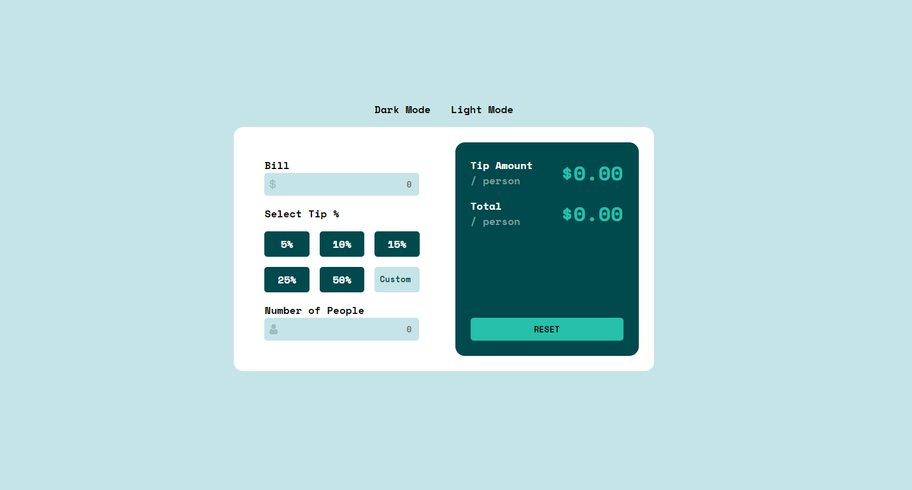
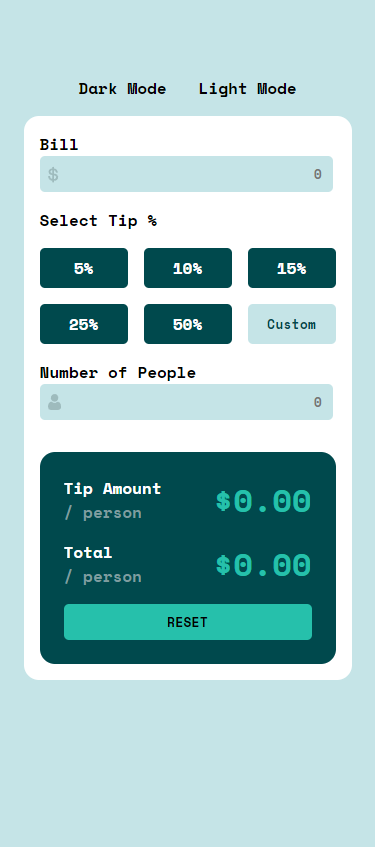

# Tip calculator app

## Screenshots

## Welcome! 👋

Thanks for checking out this front-end coding challenge.

## The challenge

Your users should be able to:

- View the optimal layout for the app depending on their device's screen size
- See hover states for all interactive elements on the page
- Calculate the correct tip and total cost of the bill per person
- Bonus: I added a theme switcher because the app felt like it was too bright for me.

## Built with:

- HTML
- CSS
- CSS Flexbox
- CSS Grid
- Javascript

## Live site URL:

- https://dlxzeus777.github.io/tip-calculator-app/
